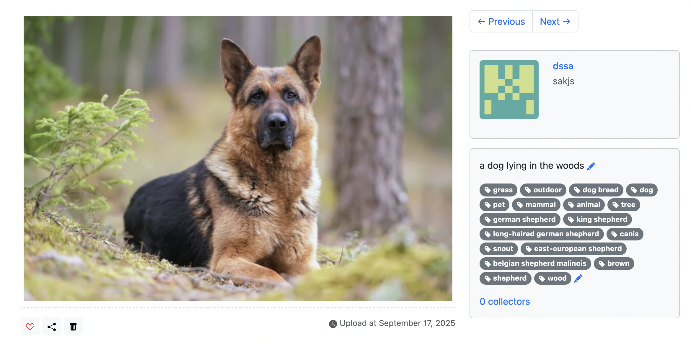

# Moments

A photo sharing social networking app built with Python and Flask. The example application for the book *[Python Web Development with Flask (2nd edition)](https://helloflask.com/en/book/4)* (《[Flask Web 开发实战（第 2 版）](https://helloflask.com/book/4)》).




## Installation

Clone the repo:

```
$ git clone https://github.com/greyli/moments
$ cd moments
```

Create and activate a virtual environment:

```
python3 -m venv .venv
source .venv/bin/activate    # On macOS/Linux
# .venv\Scripts\activate     # On Windows PowerShell

```

Install dependencies:

```
pip install -r requirements.txt
```

Configuration

Set up environment variables for Azure Vision API (needed for ML-powered captions & tags). Put the keys in .flaskenv

```
export AZURE_VISION_ENDPOINT="https://<your-endpoint>.cognitiveservices.azure.com/"
export AZURE_VISION_KEY="<your-key>"
```
To initialize the app, run the `flask init-app` command:

```
$ flask init-app
```

If you just want to try it out, generate fake data with `flask lorem` command then run the app: this will only create blank image

```
$ run flask lorem
```

It will create a test account with blank image:

* email: `admin@helloflask.com`
* password: `moments`

Now you can run the app:

```
$ pdm run flask run
* Running on http://127.0.0.1:5000/
```

Upload images and then click the uploaded images for description.
## License

This project is licensed under the MIT License (see the
[LICENSE](LICENSE) file for details).
